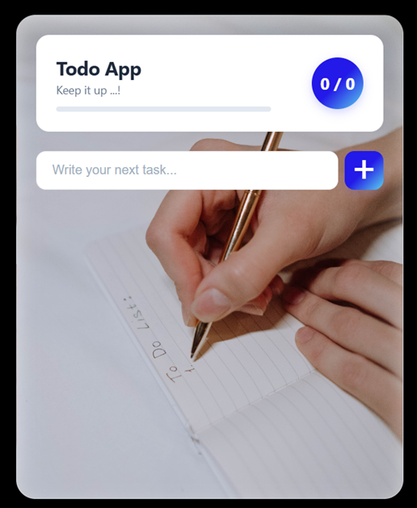
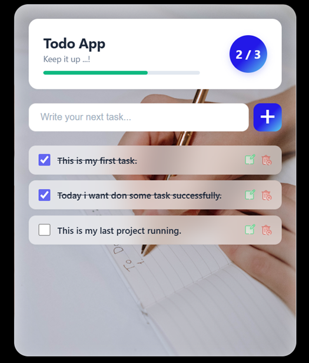

# To-Do List Web App

A sleek, responsive, and feature-rich **To-Do List Web Application** built with vanilla JavaScript, HTML5, and CSS3. This app helps you manage your daily tasks efficiently with real-time progress tracking and persistent local storage.

## 🔗 GitHub Repository
You can find the project repository here: https://github.com/somnathlive/codeOrbit_To-Do List Web App
---

## Screenshots


| Main Interface | Task Progress View |
| :---: | :---: |
|  |  |

---

##  Features
- **Add & Edit Tasks**: Easily add new tasks or edit existing ones on the fly.
- **Task Completion Toggle**: Mark tasks as complete with a visual strikethrough effect and status update.
- **Delete Tasks**: Remove items you no longer need from your list.
- **Dynamic Progress Bar**: Visual feedback displaying task completion percentage and a numerical counter (`Completed / Total`).
- **Local Storage Integration**: Your tasks are saved locally in the browser so you never lose your data upon refresh.
- **Modern UI/UX**: Designed with a clean glassmorphism aesthetic, custom scrollbars, and responsive elements.

---

##  Built With
- **HTML5** - Structuring the application content and layout.
- **CSS3** - Styling with custom variables, flexbox, and modern visual effects.
- **JavaScript (ES6+)** - Managing application state, DOM manipulation, and local storage.

---

##  Getting Started

To run this project locally, follow these simple steps:

1. **Clone the repository:**
   ```bash
   git clone https://github.com/somnathlive/CodeOrbit_To-Do-List-Web-App

2. **Extract the zip file:**
   open todoApp.html file in and show result
